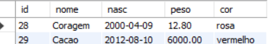

# banco_de_dados_animais

## ETAPA 1

PARA ESSE EXERCÍCIO SIGA AS INSTRUÇÕES ABAIXO:

Crie a tabela animais, conforme o exemplo demonstrado, durante a aula do dia 11/09/23;

Insira todos os valores disponíveis no slide 8;

Após a inserção execute cada uma das atividades a seguir:

### Selecione todos os animais
```sql
-- Mostra todos os animais inseridos na tabela
SELECT * FROM Animais;
```


### Selecione todos os animais que pesam menos que 13.1
```sql
-- Seleciona todos os animais com peso <= 13.1
select * from animais where peso <= 13.1;
```


### Selecione todos nasceram entre fevereiro e dezembro de 2015
```sql
-- Seleciona todos os animais nascidos entre 2015-02-01 e 2015-12-31
select * from animais where nasc between '2015-02-01' AND '2015-12-31';
```
!(nasceram)[nasceram.png]
### Selecione todos os animais brancos que pesam menos que 15.0
```sql
-- Seleciona todos os animais brancos com peso < 15
select * from animais where cor = 'branco' and peso < 15;
```

### Selecione nome, cor e peso de todos cujo nome comece com ’B’
```sql
-- Seleciona nome, cor e peso de todos os animais cujo nome começa com "B"
select nome, cor, peso from animais where nome like 'B%';
```

### Selecione nome, cor e peso de todos com cor vermelha, amarela, marrom e laranja
```sql
-- Seleciona nome, cor e peso de todos os animais com cor vermelha, amarela, marrom ou laranja

select nome, cor, peso from animais where cor in ('vermelho','amarelo','marrom','laranja');
```

### Selecione nome, cor, data de nascimento e peso de todos ordenados pelos mais jovens
```sql
-- Seleciona nome, data de nascimento, cor e peso de todos os animais, ordenados pela data de nascimento decrescente

select nome as Nome, nasc as Data_de_nascimento,cor as Cor, peso as Peso from animais order by nasc desc;
```

### Selecione todos os animais cujo nome comece com 'C' e não sejam brancos
```sql
-- Seleciona todos os animais cujo nome começa com "C" e cor não é branco

select * from animais where  nome like 'C%' and not cor = 'branco';
```

### Selecione todos os animais cujo nome contenha 'ba'
```sql
-- Seleciona todos os animais cujo nome contém a string "ba"

select * from animais where nome like '%ba%';
```

### Selecione todos os animais com peso entre 13.0 à 15.0
```sql
-- Seleciona todos os animais com peso entre 13 e 15
select * from animais where peso between 13 and 15;

```

### Selecione todos os animais que o peso não seja maior que 30, com cor amarelo ou roxo e nascidos depois de 2012
```sql
-- Seleciona todos os animais com peso menor que 30, cor amarela ou roxa, e nascidos no ano de 2012
SELECT * FROM animais WHERE peso < 30 AND cor IN ('amarelo', 'roxo') AND YEAR(nasc) = 2012;
```
![depois_2012(depois_2012.png)
### (Desafio) Selecione todos os capricornianos
```sql
-- Seleciona todos os animais nascidos em dezembro no dia 22 ou depois, ou nascidos em janeiro no dia 19 ou antes - Capricornianos
select * from animais where month(nasc) = 12 and day (nasc) >= 22 or month(nasc) = 1 and day(nasc) <= 19;
```

### (Desafio) Selecione todos os animais com nome formado por mais de uma palavra.
```sql
-- Seleciona todos os animais com nome formado duas palavras
select * from animais where length(nome)  - length(replace(nome,' ', '')) >=1;
```


## Código

